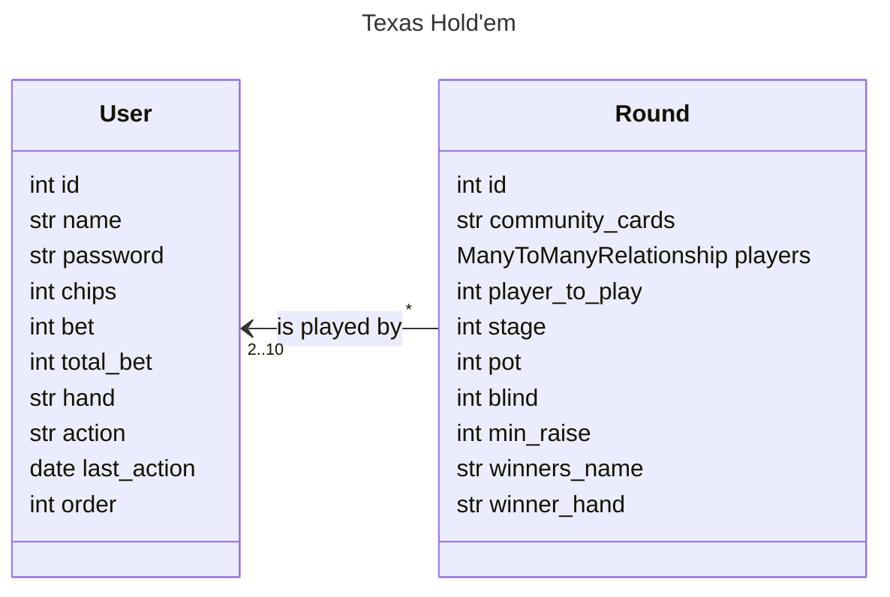
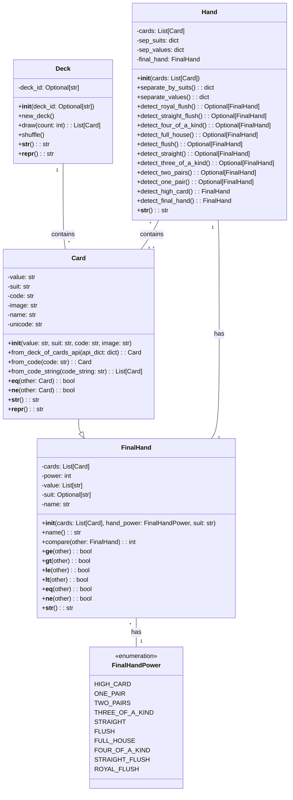

Guillaume TARPIN-BERNARD / Charles CARRERE
# Sujet : Un jeu de carte en ligne - Texas Hold Em Poker

  
## Quickstart
```bash
git clone https://github.com/KioKah/texas-hold-em
pip install -r requirements.txt
python3 manage.py makemigrations
python3 manage.py migrate
python3 manage.py runserver
```
L'interface est accessible à l'adresse http://127.0.0.1:8000/ 

## Description 
### Généralités 
L'objectif principal de ce projet de jeu de poker Texas Hold'em en ligne est de fournir une plateforme interactive où les joueurs peuvent participer à des parties de poker.

Le jeu est conçu pour simuler l'expérience du poker Texas Hold'em, en respectant ses règles traditionnelles.
### Organisation du Code
Le code est organisé autour d'une architecture modulaire qui sépare clairement la logique du jeu, la gestion des utilisateurs, et l'interface utilisateur. Ceci est réalisé à travers l'utilisation du framework Django,
#### Applications
##### authentication
Gere la creation des comptes et l'authentifications des utilisateurs
##### holdem
Gere la table de poker en elle meme

#### Modules
L'arborescence des modules est celle traditionnellement utilisée pour les projets Django
Dans ce projet, le coeur du code se situe dans les vues et le module game dans l'application holdem.

### Fonctionnement général du code
#### La base de données
(voir diagramme de classes base de données)
La base de données est composée des différentes tables nécessaires au fonctionnement de Django et de deux classe qui nous sont utiles pour l'application
##### User
Nous utilisons la table User de base de Django que nous surchargeons pour nos besoin 
###### Round
Nous stockons les données des rounds qui nous permettent de faire avancer le jeu

#### Logique
La logique est gérée dans les views, en particulier celle de l'application holdem
Lorsque l'utilisateur charge la page home, il déclenche l'execution du code de cette vue sur le serveur.
Le code vérifie alors l'état du user et du round en cours dans la base de données et le fait évoluer en fonction de cet état et des actions utilisateurs
La logique propre au jeu est implémenté dans le module game.

  

## Diagramme de classe

  
### La base de données

### Les classes métier

  
  

## Scénario d'Utilisation : 
1. Inscription sur la page dédiée
2. Connexion 
3. Arrivée dans un round vide
	1. Attente jusqu'à l'arrivée d'un deuxième joueur
	2. lancement de la partie
4.  Arrivée lors d'un round en cours
	1. Jouer le prochain round
5. Jouer la partie à l'aide de l'interface

## Tests
### Application
Pour tester plusieurs profils en même temps et jouer contre vous-même, vous pouvez utiliser le mode incognito ou une extension comme Firefox Multi-Account Containers.

### Lancement des tests pour le calcul des meilleures mains
``` bash
python3 test_hand.py
```
